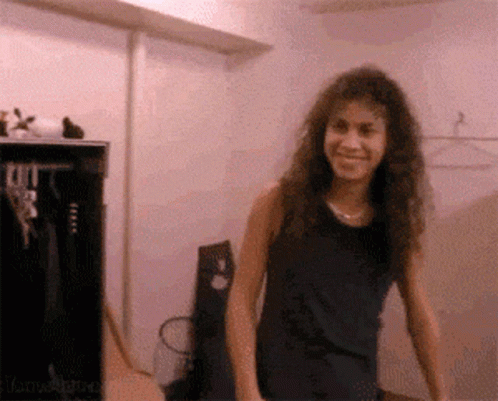

  

###

  
  
  

###

  

###

<h1  href="https://git.io/typing-svg"> </h1>

<h3 align="left">👩‍💻  About Me</h3>

###

I'm tota from Portugal   - 🔭 I’m a student in ESJA  - 📚 I'm currently learning C++ - ⚡ In my free time I play video games and listen to metal - 📠Most of the things you will find here are for storage purposes. 

###

<h3 align="left">🛠 Language and tools</h3>

###

  
  
  

###

<h3 align="left">🔥   My Stats :</h3>

###

  

###

  

###
